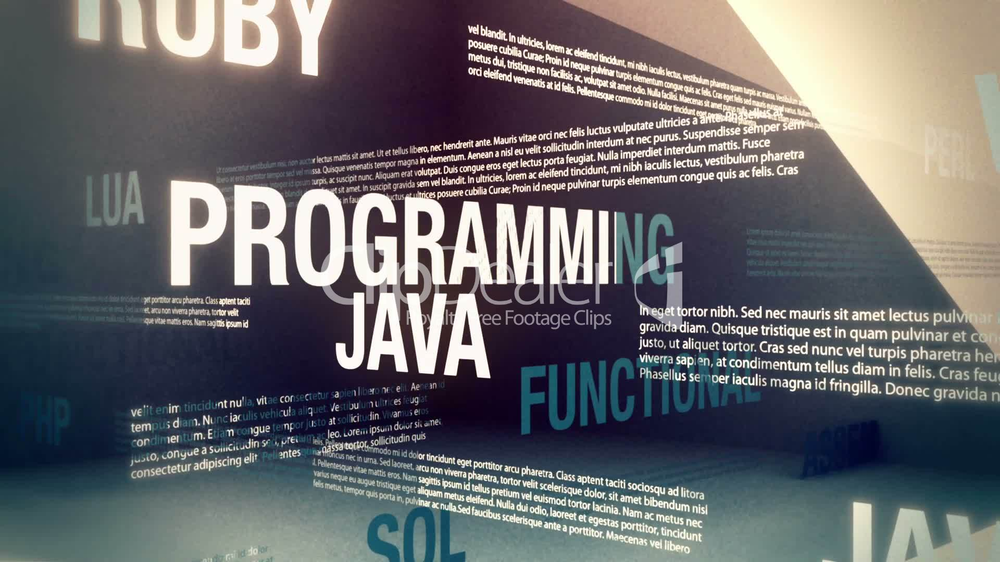

<html lang="en">
  <head>
    <meta charset="utf-8">
    <meta http-equiv="X-UA-Compatible" content="IE=edge">
    <meta name="viewport" content="width=device-width, initial-scale=1">
    <!-- The above 3 meta tags *must* come first in the head; any other head content must come *after* these tags -->
    <title>DEVCOM PROJECTS</title>

    <!-- Bootstrap -->
    <link href="css/bootstrap.min.css" rel="stylesheet">
    <link href="https://fonts.googleapis.com/css?family=Droid+Serif" rel="stylesheet">

    <!-- HTML5 shim and Respond.js for IE8 support of HTML5 elements and media queries -->
    <!-- WARNING: Respond.js doesn't work if you view the page via file:// -->
    <!--[if lt IE 9]>
      
      
    <![endif]-->

  </head>
  <body style="background-image:url(http://previews.123rf.com/images/ilyaka1972/ilyaka19721210/ilyaka1972121000055/15964956-technology-gray-abstract-background-Stock-Photo-wallpaper-web-design.jpg);">
    

    

  
  
 DEVCOM PROJECTS

  
  
 DEVCOM PROJECTS

  
  
 DEVCOM PROJECTS

 

   
   
   
 

     
   
 
 
 

<h2>About us</h2>

DEVCOM (Developer community)TEAM 
as the community is not bound by this team, its extend exceeds beyond its previous members ,seniors and passouts . I hope this time, this platform will be able to incubate some truly amazing developers out of CEC . 
Teach.
Learn.
Contribute.
hoping for the best 
we are devcom 

<h2>Our Team</h2>
 

<table >
<tr>
      <th>Sooraj Parakkattil</th>
      <th> Team Leader</th>
      <th><a href="https://www.facebook.com/soorajiam" class="btn">More info</a></th>
      </tr>
<tr>
      <th>Adnan Maqbool</th>
      <th>Communicator</th>
      <th><a href="https://www.facebook.com/profile.php?id=1397376003" class="btn">More info</a></th></tr>
<tr>
      <th>Megha Nair</th>
      <th>Coordinator</th>
      <th><a href="https://www.facebook.com/megha.nair.758" class="btn">More info </a></th></tr>
<tr>
      <th>Team Members</th>
      <th><a href="https://www.facebook.com/photo.php?fbid=1286798481376571&set=a.310638012325961.73424.100001392943546&type=3&theater" class="btn">More info</a></th></tr>

</table>

   <h3>Our New Projects</h3>
<

    <!-- jQuery (necessary for Bootstrap's JavaScript plugins) -->
    
    <!-- Include all compiled plugins (below), or include individual files as needed -->
    
 

  </body>
</html>
